# Projects and dependencies analysis

This document provides a comprehensive overview of the projects and their dependencies in the context of upgrading to .NETCoreApp,Version=v10.0.

## Table of Contents

- [Executive Summary](#executive-Summary)
  - [Highlevel Metrics](#highlevel-metrics)
  - [Projects Compatibility](#projects-compatibility)
  - [Package Compatibility](#package-compatibility)
  - [API Compatibility](#api-compatibility)
- [Aggregate NuGet packages details](#aggregate-nuget-packages-details)
- [Top API Migration Challenges](#top-api-migration-challenges)
  - [Technologies and Features](#technologies-and-features)
  - [Most Frequent API Issues](#most-frequent-api-issues)
- [Projects Relationship Graph](#projects-relationship-graph)
- [Project Details](#project-details)

  - [Perf\CoreWf.Benchmarks\CoreWf.Benchmarks.csproj](#perfcorewfbenchmarkscorewfbenchmarkscsproj)
  - [Perf\Perf.AssemblyReference.Benchmarks\Perf.AssemblyReference.Benchmarks.csproj](#perfperfassemblyreferencebenchmarksperfassemblyreferencebenchmarkscsproj)
  - [Quorum.CoreWF.Core\Quorum.CoreWF.Core.csproj](#quorumcorewfcorequorumcorewfcorecsproj)
  - [Quorum.CoreWF.EtwTracking\Quorum.CoreWF.EtwTracking.csproj](#quorumcorewfetwtrackingquorumcorewfetwtrackingcsproj)
  - [Quorum.CoreWF.Runtime\Quorum.CoreWF.Runtime.csproj](#quorumcorewfruntimequorumcorewfruntimecsproj)
  - [Quorum.CoreWF.Xaml\Quorum.CoreWF.Xaml.csproj](#quorumcorewfxamlquorumcorewfxamlcsproj)
  - [Test\CustomTestObjects\CustomTestObjects.csproj](#testcustomtestobjectscustomtestobjectscsproj)
  - [Test\ImperativeTestCases\ImperativeTestCases.csproj](#testimperativetestcasesimperativetestcasescsproj)
  - [Test\System.Xaml.TestCases\System.Xaml.TestCases.csproj](#testsystemxamltestcasessystemxamltestcasescsproj)
  - [Test\TestCases.Activities\TestCases.Activities.csproj](#testtestcasesactivitiestestcasesactivitiescsproj)
  - [Test\TestCases.Runtime\TestCases.Runtime.csproj](#testtestcasesruntimetestcasesruntimecsproj)
  - [Test\TestCases.Workflows\TestCases.Workflows.csproj](#testtestcasesworkflowstestcasesworkflowscsproj)
  - [Test\TestCases.Xaml\TestCases.Xaml.csproj](#testtestcasesxamltestcasesxamlcsproj)
  - [Test\TestConsole\TestConsole.csproj](#testtestconsoletestconsolecsproj)
  - [Test\TestObjects\TestObjects.csproj](#testtestobjectstestobjectscsproj)
  - [Test\WorkflowApplicationTestExtensions\WorkflowApplicationTestExtensions.csproj](#testworkflowapplicationtestextensionsworkflowapplicationtestextensionscsproj)
  - [VisualBasic\Microsoft.CodeAnalysis.VisualBasic.Scripting.vbproj](#visualbasicmicrosoftcodeanalysisvisualbasicscriptingvbproj)

## Executive Summary

### Highlevel Metrics

| Metric | Count | Status |
| :--- | :---: | :--- |
| Total Projects | 17 | All require upgrade |
| Total NuGet Packages | 69 | 14 need upgrade |
| Total Code Files | 1151 |  |
| Total Code Files with Incidents | 91 |  |
| Total Lines of Code | 236816 |  |
| Total Number of Issues | 2487 |  |
| Estimated LOC to modify | 2429+ | at least 1.0% of codebase |

### Projects Compatibility

| Project | Target Framework | Difficulty | Package Issues | API Issues | Est. LOC Impact | Description |
| :--- | :---: | :---: | :---: | :---: | :---: | :--- |
| [Perf\CoreWf.Benchmarks\CoreWf.Benchmarks.csproj](#perfcorewfbenchmarkscorewfbenchmarkscsproj) | net6.0 | 🟢 Low | 1 | 0 |  | DotNetCoreApp, Sdk Style = True |
| [Perf\Perf.AssemblyReference.Benchmarks\Perf.AssemblyReference.Benchmarks.csproj](#perfperfassemblyreferencebenchmarksperfassemblyreferencebenchmarkscsproj) | net6.0;net6.0-windows | 🟢 Low | 13 | 8 | 8+ | DotNetCoreApp, Sdk Style = True |
| [Quorum.CoreWF.Core\Quorum.CoreWF.Core.csproj](#quorumcorewfcorequorumcorewfcorecsproj) | net6.0 | 🟢 Low | 2 | 2120 | 2120+ | ClassLibrary, Sdk Style = True |
| [Quorum.CoreWF.EtwTracking\Quorum.CoreWF.EtwTracking.csproj](#quorumcorewfetwtrackingquorumcorewfetwtrackingcsproj) | net6.0 | 🟢 Low | 2 | 0 |  | ClassLibrary, Sdk Style = True |
| [Quorum.CoreWF.Runtime\Quorum.CoreWF.Runtime.csproj](#quorumcorewfruntimequorumcorewfruntimecsproj) | net6.0 | 🟢 Low | 1 | 23 | 23+ | ClassLibrary, Sdk Style = True |
| [Quorum.CoreWF.Xaml\Quorum.CoreWF.Xaml.csproj](#quorumcorewfxamlquorumcorewfxamlcsproj) | net6.0 | 🟢 Low | 1 | 95 | 95+ | ClassLibrary, Sdk Style = True |
| [Test\CustomTestObjects\CustomTestObjects.csproj](#testcustomtestobjectscustomtestobjectscsproj) | net6.0 | 🟢 Low | 2 | 0 |  | DotNetCoreApp, Sdk Style = True |
| [Test\ImperativeTestCases\ImperativeTestCases.csproj](#testimperativetestcasesimperativetestcasescsproj) | net6.0 | 🟢 Low | 2 | 0 |  | DotNetCoreApp, Sdk Style = True |
| [Test\System.Xaml.TestCases\System.Xaml.TestCases.csproj](#testsystemxamltestcasessystemxamltestcasescsproj) | net6.0 | 🟢 Low | 2 | 17 | 17+ | DotNetCoreApp, Sdk Style = True |
| [Test\TestCases.Activities\TestCases.Activities.csproj](#testtestcasesactivitiestestcasesactivitiescsproj) | net6.0 | 🟢 Low | 2 | 2 | 2+ | DotNetCoreApp, Sdk Style = True |
| [Test\TestCases.Runtime\TestCases.Runtime.csproj](#testtestcasesruntimetestcasesruntimecsproj) | net6.0 | 🟢 Low | 2 | 13 | 13+ | DotNetCoreApp, Sdk Style = True |
| [Test\TestCases.Workflows\TestCases.Workflows.csproj](#testtestcasesworkflowstestcasesworkflowscsproj) | net6.0 | 🟢 Low | 2 | 53 | 53+ | DotNetCoreApp, Sdk Style = True |
| [Test\TestCases.Xaml\TestCases.Xaml.csproj](#testtestcasesxamltestcasesxamlcsproj) | net6.0 | 🟢 Low | 2 | 6 | 6+ | DotNetCoreApp, Sdk Style = True |
| [Test\TestConsole\TestConsole.csproj](#testtestconsoletestconsolecsproj) | net6.0 | 🟢 Low | 2 | 0 |  | DotNetCoreApp, Sdk Style = True |
| [Test\TestObjects\TestObjects.csproj](#testtestobjectstestobjectscsproj) | net6.0 | 🟢 Low | 2 | 91 | 91+ | DotNetCoreApp, Sdk Style = True |
| [Test\WorkflowApplicationTestExtensions\WorkflowApplicationTestExtensions.csproj](#testworkflowapplicationtestextensionsworkflowapplicationtestextensionscsproj) | net6.0 | 🟢 Low | 2 | 1 | 1+ | DotNetCoreApp, Sdk Style = True |
| [VisualBasic\Microsoft.CodeAnalysis.VisualBasic.Scripting.vbproj](#visualbasicmicrosoftcodeanalysisvisualbasicscriptingvbproj) | net6.0 | 🟢 Low | 1 | 0 |  | ClassLibrary, Sdk Style = True |

### Package Compatibility

| Status | Count | Percentage |
| :--- | :---: | :---: |
| ✅ Compatible | 55 | 79.7% |
| ⚠️ Incompatible | 3 | 4.3% |
| 🔄 Upgrade Recommended | 11 | 15.9% |
| ***Total NuGet Packages*** | ***69*** | ***100%*** |

### API Compatibility

| Category | Count | Impact |
| :--- | :---: | :--- |
| 🔴 Binary Incompatible | 0 | High - Require code changes |
| 🟡 Source Incompatible | 2313 | Medium - Needs re-compilation and potential conflicting API error fixing |
| 🔵 Behavioral change | 116 | Low - Behavioral changes that may require testing at runtime |
| ✅ Compatible | 140533 |  |
| ***Total APIs Analyzed*** | ***142962*** |  |

## Aggregate NuGet packages details

| Package | Current Version | Suggested Version | Projects | Description |
| :--- | :---: | :---: | :--- | :--- |
| AgileObjects.ReadableExpressions | 3.1.0 |  | [TestCases.Workflows.csproj](#testtestcasesworkflowstestcasesworkflowscsproj) | ✅Compatible |
| AutoMapper | 9.0.0 |  | [Perf.AssemblyReference.Benchmarks.csproj](#perfperfassemblyreferencebenchmarksperfassemblyreferencebenchmarkscsproj) | ✅Compatible |
| Azure.Identity | 1.14.0 |  | [Perf.AssemblyReference.Benchmarks.csproj](#perfperfassemblyreferencebenchmarksperfassemblyreferencebenchmarkscsproj) | ⚠️NuGet package is deprecated |
| Azure.Messaging.ServiceBus | 7.20.1 |  | [Perf.AssemblyReference.Benchmarks.csproj](#perfperfassemblyreferencebenchmarksperfassemblyreferencebenchmarkscsproj) | ✅Compatible |
| Azure.Storage.Blobs | 12.24.1 |  | [Perf.AssemblyReference.Benchmarks.csproj](#perfperfassemblyreferencebenchmarksperfassemblyreferencebenchmarkscsproj) | ✅Compatible |
| BenchmarkDotNet | 0.13.1 |  | [CoreWf.Benchmarks.csproj](#perfcorewfbenchmarkscorewfbenchmarkscsproj) [Perf.AssemblyReference.Benchmarks.csproj](#perfperfassemblyreferencebenchmarksperfassemblyreferencebenchmarkscsproj) | ✅Compatible |
| Bogus | 35.6.3 |  | [Perf.AssemblyReference.Benchmarks.csproj](#perfperfassemblyreferencebenchmarksperfassemblyreferencebenchmarkscsproj) | ✅Compatible |
| ClosedXML | 0.105.0 |  | [Perf.AssemblyReference.Benchmarks.csproj](#perfperfassemblyreferencebenchmarksperfassemblyreferencebenchmarkscsproj) | ✅Compatible |
| CsvHelper | 33.1.0 |  | [Perf.AssemblyReference.Benchmarks.csproj](#perfperfassemblyreferencebenchmarksperfassemblyreferencebenchmarkscsproj) | ✅Compatible |
| Dapper | 2.1.66 |  | [Perf.AssemblyReference.Benchmarks.csproj](#perfperfassemblyreferencebenchmarksperfassemblyreferencebenchmarkscsproj) | ✅Compatible |
| EPPlus | 8.0.6 |  | [Perf.AssemblyReference.Benchmarks.csproj](#perfperfassemblyreferencebenchmarksperfassemblyreferencebenchmarkscsproj) | ✅Compatible |
| FluentValidation | 6.4.1 |  | [Perf.AssemblyReference.Benchmarks.csproj](#perfperfassemblyreferencebenchmarksperfassemblyreferencebenchmarkscsproj) | ✅Compatible |
| Google.Apis | 1.70.0 |  | [Perf.AssemblyReference.Benchmarks.csproj](#perfperfassemblyreferencebenchmarksperfassemblyreferencebenchmarkscsproj) | ✅Compatible |
| Google.Apis.Auth | 1.70.0 |  | [Perf.AssemblyReference.Benchmarks.csproj](#perfperfassemblyreferencebenchmarksperfassemblyreferencebenchmarkscsproj) | ✅Compatible |
| Google.Cloud.Storage.V1 | 4.13.0 |  | [Perf.AssemblyReference.Benchmarks.csproj](#perfperfassemblyreferencebenchmarksperfassemblyreferencebenchmarkscsproj) | ✅Compatible |
| Hangfire.Core | 1.8.20 |  | [Perf.AssemblyReference.Benchmarks.csproj](#perfperfassemblyreferencebenchmarksperfassemblyreferencebenchmarkscsproj) | ✅Compatible |
| HtmlAgilityPack | 1.12.1 |  | [Perf.AssemblyReference.Benchmarks.csproj](#perfperfassemblyreferencebenchmarksperfassemblyreferencebenchmarkscsproj) | ✅Compatible |
| Humanizer | 2.14.1 |  | [Perf.AssemblyReference.Benchmarks.csproj](#perfperfassemblyreferencebenchmarksperfassemblyreferencebenchmarkscsproj) | ✅Compatible |
| MailKit | 4.12.1 |  | [Perf.AssemblyReference.Benchmarks.csproj](#perfperfassemblyreferencebenchmarksperfassemblyreferencebenchmarkscsproj) | ✅Compatible |
| MediatR | 12.5.0 |  | [Perf.AssemblyReference.Benchmarks.csproj](#perfperfassemblyreferencebenchmarksperfassemblyreferencebenchmarkscsproj) | ✅Compatible |
| Microsoft.AspNetCore | 2.3.0 |  | [Perf.AssemblyReference.Benchmarks.csproj](#perfperfassemblyreferencebenchmarksperfassemblyreferencebenchmarkscsproj) | ✅Compatible |
| Microsoft.AspNetCore.Authentication | 2.3.0 |  | [Perf.AssemblyReference.Benchmarks.csproj](#perfperfassemblyreferencebenchmarksperfassemblyreferencebenchmarkscsproj) | ✅Compatible |
| Microsoft.AspNetCore.Authorization | 9.0.6 | 10.0.2 | [Perf.AssemblyReference.Benchmarks.csproj](#perfperfassemblyreferencebenchmarksperfassemblyreferencebenchmarkscsproj) | NuGet package upgrade is recommended |
| Microsoft.AspNetCore.Http | 2.3.0 |  | [Perf.AssemblyReference.Benchmarks.csproj](#perfperfassemblyreferencebenchmarksperfassemblyreferencebenchmarkscsproj) | ✅Compatible |
| Microsoft.AspNetCore.Mvc | 2.3.0 |  | [Perf.AssemblyReference.Benchmarks.csproj](#perfperfassemblyreferencebenchmarksperfassemblyreferencebenchmarkscsproj) | ✅Compatible |
| Microsoft.AspNetCore.Routing | 2.3.0 |  | [Perf.AssemblyReference.Benchmarks.csproj](#perfperfassemblyreferencebenchmarksperfassemblyreferencebenchmarkscsproj) | ✅Compatible |
| Microsoft.AspNetCore.StaticFiles | 2.3.0 |  | [Perf.AssemblyReference.Benchmarks.csproj](#perfperfassemblyreferencebenchmarksperfassemblyreferencebenchmarkscsproj) | ✅Compatible |
| Microsoft.Azure.Cosmos | 3.52.0 |  | [Perf.AssemblyReference.Benchmarks.csproj](#perfperfassemblyreferencebenchmarksperfassemblyreferencebenchmarkscsproj) | ✅Compatible |
| Microsoft.Azure.Functions.Extensions | 1.1.0 |  | [Perf.AssemblyReference.Benchmarks.csproj](#perfperfassemblyreferencebenchmarksperfassemblyreferencebenchmarkscsproj) | ✅Compatible |
| Microsoft.Azure.ServiceBus | 5.2.0 |  | [Perf.AssemblyReference.Benchmarks.csproj](#perfperfassemblyreferencebenchmarksperfassemblyreferencebenchmarkscsproj) | ⚠️NuGet package is deprecated |
| Microsoft.Azure.Storage.Blob | 11.2.3 |  | [Perf.AssemblyReference.Benchmarks.csproj](#perfperfassemblyreferencebenchmarksperfassemblyreferencebenchmarkscsproj) | ⚠️NuGet package is deprecated |
| Microsoft.CodeAnalysis.CSharp.Features | 4.13.0-3.24620.4 |  | [TestCases.Workflows.csproj](#testtestcasesworkflowstestcasesworkflowscsproj) | ✅Compatible |
| Microsoft.CodeAnalysis.CSharp.Scripting | 4.13.0-3.24620.4 |  | [Quorum.CoreWF.Core.csproj](#quorumcorewfcorequorumcorewfcorecsproj) | ✅Compatible |
| Microsoft.CodeAnalysis.Scripting.Common | 4.13.0-3.24620.4 |  | [Microsoft.CodeAnalysis.VisualBasic.Scripting.vbproj](#visualbasicmicrosoftcodeanalysisvisualbasicscriptingvbproj) | ✅Compatible |
| Microsoft.CodeAnalysis.VisualBasic | 4.13.0-3.24620.4 |  | [Microsoft.CodeAnalysis.VisualBasic.Scripting.vbproj](#visualbasicmicrosoftcodeanalysisvisualbasicscriptingvbproj) [Quorum.CoreWF.Core.csproj](#quorumcorewfcorequorumcorewfcorecsproj) | ✅Compatible |
| Microsoft.CodeAnalysis.VisualBasic.Features | 4.13.0-3.24620.4 |  | [TestCases.Workflows.csproj](#testtestcasesworkflowstestcasesworkflowscsproj) | ✅Compatible |
| Microsoft.CodeAnalysis.Workspaces.Common | 4.13.0-3.24620.4 |  | [TestCases.Workflows.csproj](#testtestcasesworkflowstestcasesworkflowscsproj) | ✅Compatible |
| Microsoft.Extensions.Configuration | 9.0.6 | 10.0.2 | [Perf.AssemblyReference.Benchmarks.csproj](#perfperfassemblyreferencebenchmarksperfassemblyreferencebenchmarkscsproj) | NuGet package upgrade is recommended |
| Microsoft.Extensions.Configuration.Json | 9.0.6 | 10.0.2 | [Perf.AssemblyReference.Benchmarks.csproj](#perfperfassemblyreferencebenchmarksperfassemblyreferencebenchmarkscsproj) | NuGet package upgrade is recommended |
| Microsoft.Extensions.DependencyInjection | 9.0.6 | 10.0.2 | [Perf.AssemblyReference.Benchmarks.csproj](#perfperfassemblyreferencebenchmarksperfassemblyreferencebenchmarkscsproj) | NuGet package upgrade is recommended |
| Microsoft.Extensions.Logging | 9.0.6 | 10.0.2 | [Perf.AssemblyReference.Benchmarks.csproj](#perfperfassemblyreferencebenchmarksperfassemblyreferencebenchmarkscsproj) | NuGet package upgrade is recommended |
| Microsoft.Extensions.Options | 9.0.6 | 10.0.2 | [Perf.AssemblyReference.Benchmarks.csproj](#perfperfassemblyreferencebenchmarksperfassemblyreferencebenchmarkscsproj) | NuGet package upgrade is recommended |
| Microsoft.IdentityModel.Protocols | 8.12.1 |  | [Perf.AssemblyReference.Benchmarks.csproj](#perfperfassemblyreferencebenchmarksperfassemblyreferencebenchmarkscsproj) | ✅Compatible |
| Microsoft.IdentityModel.Tokens | 8.12.1 |  | [Perf.AssemblyReference.Benchmarks.csproj](#perfperfassemblyreferencebenchmarksperfassemblyreferencebenchmarkscsproj) | ✅Compatible |
| Microsoft.NET.Test.Sdk | 17.0.0 |  | [CustomTestObjects.csproj](#testcustomtestobjectscustomtestobjectscsproj) [ImperativeTestCases.csproj](#testimperativetestcasesimperativetestcasescsproj) [System.Xaml.TestCases.csproj](#testsystemxamltestcasessystemxamltestcasescsproj) [TestCases.Activities.csproj](#testtestcasesactivitiestestcasesactivitiescsproj) [TestCases.Runtime.csproj](#testtestcasesruntimetestcasesruntimecsproj) [TestCases.Workflows.csproj](#testtestcasesworkflowstestcasesworkflowscsproj) [TestCases.Xaml.csproj](#testtestcasesxamltestcasesxamlcsproj) [TestConsole.csproj](#testtestconsoletestconsolecsproj) [TestObjects.csproj](#testtestobjectstestobjectscsproj) [WorkflowApplicationTestExtensions.csproj](#testworkflowapplicationtestextensionsworkflowapplicationtestextensionscsproj) | ✅Compatible |
| Microsoft.SourceLink.GitHub | 1.1.1 |  | [Quorum.CoreWF.Core.csproj](#quorumcorewfcorequorumcorewfcorecsproj) [Quorum.CoreWF.Runtime.csproj](#quorumcorewfruntimequorumcorewfruntimecsproj) | ✅Compatible |
| MongoDB.Driver | 3.4.0 |  | [Perf.AssemblyReference.Benchmarks.csproj](#perfperfassemblyreferencebenchmarksperfassemblyreferencebenchmarkscsproj) | ✅Compatible |
| Newtonsoft.Json | 13.0.2 | 13.0.4 | [Quorum.CoreWF.EtwTracking.csproj](#quorumcorewfetwtrackingquorumcorewfetwtrackingcsproj) | NuGet package upgrade is recommended |
| Newtonsoft.Json | 13.0.3 | 13.0.4 | [CustomTestObjects.csproj](#testcustomtestobjectscustomtestobjectscsproj) [ImperativeTestCases.csproj](#testimperativetestcasesimperativetestcasescsproj) [Perf.AssemblyReference.Benchmarks.csproj](#perfperfassemblyreferencebenchmarksperfassemblyreferencebenchmarkscsproj) [System.Xaml.TestCases.csproj](#testsystemxamltestcasessystemxamltestcasescsproj) [TestCases.Activities.csproj](#testtestcasesactivitiestestcasesactivitiescsproj) [TestCases.Runtime.csproj](#testtestcasesruntimetestcasesruntimecsproj) [TestCases.Workflows.csproj](#testtestcasesworkflowstestcasesworkflowscsproj) [TestCases.Xaml.csproj](#testtestcasesxamltestcasesxamlcsproj) [TestConsole.csproj](#testtestconsoletestconsolecsproj) [TestObjects.csproj](#testtestobjectstestobjectscsproj) [WorkflowApplicationTestExtensions.csproj](#testworkflowapplicationtestextensionsworkflowapplicationtestextensionscsproj) | NuGet package upgrade is recommended |
| Nito.AsyncEx.Tasks | 5.1.2 |  | [Quorum.CoreWF.Core.csproj](#quorumcorewfcorequorumcorewfcorecsproj) [WorkflowApplicationTestExtensions.csproj](#testworkflowapplicationtestextensionsworkflowapplicationtestextensionscsproj) | ✅Compatible |
| NLog | 6.0.0 |  | [Perf.AssemblyReference.Benchmarks.csproj](#perfperfassemblyreferencebenchmarksperfassemblyreferencebenchmarkscsproj) | ✅Compatible |
| NodaTime | 3.2.2 |  | [Perf.AssemblyReference.Benchmarks.csproj](#perfperfassemblyreferencebenchmarksperfassemblyreferencebenchmarkscsproj) | ✅Compatible |
| Npgsql | 9.0.3 |  | [Perf.AssemblyReference.Benchmarks.csproj](#perfperfassemblyreferencebenchmarksperfassemblyreferencebenchmarkscsproj) | ✅Compatible |
| NUnit | 3.13.2 |  | [System.Xaml.TestCases.csproj](#testsystemxamltestcasessystemxamltestcasescsproj) | ✅Compatible |
| NUnit3TestAdapter | 4.1.0 |  | [System.Xaml.TestCases.csproj](#testsystemxamltestcasessystemxamltestcasescsproj) | ✅Compatible |
| Polly | 8.6.1 |  | [Perf.AssemblyReference.Benchmarks.csproj](#perfperfassemblyreferencebenchmarksperfassemblyreferencebenchmarkscsproj) | ✅Compatible |
| ReflectionMagic | 4.1.0 |  | [Quorum.CoreWF.Core.csproj](#quorumcorewfcorequorumcorewfcorecsproj) | ✅Compatible |
| RestSharp | 112.1.0 |  | [Perf.AssemblyReference.Benchmarks.csproj](#perfperfassemblyreferencebenchmarksperfassemblyreferencebenchmarkscsproj) | ✅Compatible |
| Serilog | 4.3.0 |  | [Perf.AssemblyReference.Benchmarks.csproj](#perfperfassemblyreferencebenchmarksperfassemblyreferencebenchmarkscsproj) | ✅Compatible |
| Serilog.Sinks.Console | 6.0.0 |  | [Perf.AssemblyReference.Benchmarks.csproj](#perfperfassemblyreferencebenchmarksperfassemblyreferencebenchmarkscsproj) | ✅Compatible |
| Shouldly | 4.0.3 |  | [CustomTestObjects.csproj](#testcustomtestobjectscustomtestobjectscsproj) [ImperativeTestCases.csproj](#testimperativetestcasesimperativetestcasescsproj) [System.Xaml.TestCases.csproj](#testsystemxamltestcasessystemxamltestcasescsproj) [TestCases.Activities.csproj](#testtestcasesactivitiestestcasesactivitiescsproj) [TestCases.Runtime.csproj](#testtestcasesruntimetestcasesruntimecsproj) [TestCases.Workflows.csproj](#testtestcasesworkflowstestcasesworkflowscsproj) [TestCases.Xaml.csproj](#testtestcasesxamltestcasesxamlcsproj) [TestConsole.csproj](#testtestconsoletestconsolecsproj) [TestObjects.csproj](#testtestobjectstestobjectscsproj) [WorkflowApplicationTestExtensions.csproj](#testworkflowapplicationtestextensionsworkflowapplicationtestextensionscsproj) | ✅Compatible |
| SixLabors.ImageSharp | 3.1.11 |  | [Perf.AssemblyReference.Benchmarks.csproj](#perfperfassemblyreferencebenchmarksperfassemblyreferencebenchmarkscsproj) | ✅Compatible |
| System.CodeDom | 6.0.0 | 10.0.2 | [Quorum.CoreWF.Core.csproj](#quorumcorewfcorequorumcorewfcorecsproj) | NuGet package upgrade is recommended |
| System.Data.SqlClient | 4.9.0 |  | [Perf.AssemblyReference.Benchmarks.csproj](#perfperfassemblyreferencebenchmarksperfassemblyreferencebenchmarkscsproj) | ✅Compatible |
| System.Drawing.Common | 6.0.0 | 10.0.2 | [Perf.AssemblyReference.Benchmarks.csproj](#perfperfassemblyreferencebenchmarksperfassemblyreferencebenchmarkscsproj) | NuGet package upgrade is recommended |
| System.IO.Pipelines | 9.0.6 | 10.0.2 | [Perf.AssemblyReference.Benchmarks.csproj](#perfperfassemblyreferencebenchmarksperfassemblyreferencebenchmarkscsproj) | NuGet package upgrade is recommended |
| System.Reactive | 6.0.1 |  | [Perf.AssemblyReference.Benchmarks.csproj](#perfperfassemblyreferencebenchmarksperfassemblyreferencebenchmarkscsproj) | ✅Compatible |
| xunit | 2.4.1 |  | [CustomTestObjects.csproj](#testcustomtestobjectscustomtestobjectscsproj) [ImperativeTestCases.csproj](#testimperativetestcasesimperativetestcasescsproj) [System.Xaml.TestCases.csproj](#testsystemxamltestcasessystemxamltestcasescsproj) [TestCases.Activities.csproj](#testtestcasesactivitiestestcasesactivitiescsproj) [TestCases.Runtime.csproj](#testtestcasesruntimetestcasesruntimecsproj) [TestCases.Workflows.csproj](#testtestcasesworkflowstestcasesworkflowscsproj) [TestCases.Xaml.csproj](#testtestcasesxamltestcasesxamlcsproj) [TestConsole.csproj](#testtestconsoletestconsolecsproj) [TestObjects.csproj](#testtestobjectstestobjectscsproj) [WorkflowApplicationTestExtensions.csproj](#testworkflowapplicationtestextensionsworkflowapplicationtestextensionscsproj) | ✅Compatible |
| xunit.runner.visualstudio | 2.4.3 |  | [CustomTestObjects.csproj](#testcustomtestobjectscustomtestobjectscsproj) [ImperativeTestCases.csproj](#testimperativetestcasesimperativetestcasescsproj) [System.Xaml.TestCases.csproj](#testsystemxamltestcasessystemxamltestcasescsproj) [TestCases.Activities.csproj](#testtestcasesactivitiestestcasesactivitiescsproj) [TestCases.Runtime.csproj](#testtestcasesruntimetestcasesruntimecsproj) [TestCases.Workflows.csproj](#testtestcasesworkflowstestcasesworkflowscsproj) [TestCases.Xaml.csproj](#testtestcasesxamltestcasesxamlcsproj) [TestConsole.csproj](#testtestconsoletestconsolecsproj) [TestObjects.csproj](#testtestobjectstestobjectscsproj) [WorkflowApplicationTestExtensions.csproj](#testworkflowapplicationtestextensionsworkflowapplicationtestextensionscsproj) | ✅Compatible |

## Top API Migration Challenges

### Technologies and Features

| Technology | Issues | Percentage | Migration Path |
| :--- | :---: | :---: | :--- |
| CodeDom & Dynamic Code Generation | 2164 | 89.1% | Runtime code generation, compilation, and scripting APIs including CodeDom and JScript that have limited support in .NET Core/.NET. These were used for dynamic code generation but are largely obsolete. Consider Roslyn APIs for code generation or alternative scripting solutions. |

### Most Frequent API Issues

| API | Count | Percentage | Category |
| :--- | :---: | :---: | :--- |
| T:System.CodeDom.MemberAttributes | 161 | 6.6% | Source Incompatible |
| T:System.Uri | 90 | 3.7% | Behavioral Change |
| T:System.CodeDom.CodeTypeReference | 88 | 3.6% | Source Incompatible |
| T:System.CodeDom.CodeStatementCollection | 62 | 2.6% | Source Incompatible |
| M:System.CodeDom.CodeTypeReference.#ctor(System.Type) | 57 | 2.3% | Source Incompatible |
| T:System.CodeDom.CodeBinaryOperatorType | 56 | 2.3% | Source Incompatible |
| T:System.CodeDom.CodeVariableReferenceExpression | 56 | 2.3% | Source Incompatible |
| M:System.CodeDom.CodeVariableReferenceExpression.#ctor(System.String) | 56 | 2.3% | Source Incompatible |
| M:System.CodeDom.CodeStatementCollection.Add(System.CodeDom.CodeStatement) | 53 | 2.2% | Source Incompatible |
| T:System.CodeDom.CodePrimitiveExpression | 52 | 2.1% | Source Incompatible |
| M:System.CodeDom.CodePrimitiveExpression.#ctor(System.Object) | 52 | 2.1% | Source Incompatible |
| P:System.CodeDom.CodeMemberMethod.Statements | 49 | 2.0% | Source Incompatible |
| T:System.CodeDom.CodeMemberMethod | 48 | 2.0% | Source Incompatible |
| T:System.CodeDom.CodeTypeDeclaration | 44 | 1.8% | Source Incompatible |
| P:System.CodeDom.CodeTypeMember.Name | 43 | 1.8% | Source Incompatible |
| T:System.Data.SqlClient.SqlConnection | 43 | 1.8% | Source Incompatible |
| T:System.CodeDom.CodeTypeMemberCollection | 40 | 1.6% | Source Incompatible |
| P:System.CodeDom.CodeTypeDeclaration.Members | 40 | 1.6% | Source Incompatible |
| M:System.CodeDom.CodeTypeMemberCollection.Add(System.CodeDom.CodeTypeMember) | 40 | 1.6% | Source Incompatible |
| T:System.CodeDom.CodeAttributeDeclaration | 38 | 1.6% | Source Incompatible |
| P:System.CodeDom.CodeTypeMember.Attributes | 37 | 1.5% | Source Incompatible |
| T:System.CodeDom.CodeParameterDeclarationExpression | 35 | 1.4% | Source Incompatible |
| T:System.CodeDom.CodeParameterDeclarationExpressionCollection | 35 | 1.4% | Source Incompatible |
| P:System.CodeDom.CodeMemberMethod.Parameters | 35 | 1.4% | Source Incompatible |
| M:System.CodeDom.CodeParameterDeclarationExpressionCollection.Add(System.CodeDom.CodeParameterDeclarationExpression) | 31 | 1.3% | Source Incompatible |
| T:System.CodeDom.CodeBinaryOperatorExpression | 28 | 1.2% | Source Incompatible |
| M:System.CodeDom.CodeBinaryOperatorExpression.#ctor(System.CodeDom.CodeExpression,System.CodeDom.CodeBinaryOperatorType,System.CodeDom.CodeExpression) | 28 | 1.2% | Source Incompatible |
| T:System.CodeDom.CodeMethodInvokeExpression | 28 | 1.2% | Source Incompatible |
| T:System.CodeDom.CodeMethodReferenceExpression | 27 | 1.1% | Source Incompatible |
| T:System.CodeDom.CodeThisReferenceExpression | 27 | 1.1% | Source Incompatible |
| M:System.CodeDom.CodeThisReferenceExpression.#ctor | 27 | 1.1% | Source Incompatible |
| M:System.CodeDom.CodeMethodReferenceExpression.#ctor(System.CodeDom.CodeExpression,System.String) | 26 | 1.1% | Source Incompatible |
| M:System.CodeDom.CodeMethodInvokeExpression.#ctor(System.CodeDom.CodeMethodReferenceExpression,System.CodeDom.CodeExpression[]) | 25 | 1.0% | Source Incompatible |
| T:System.CodeDom.CodeMethodReturnStatement | 24 | 1.0% | Source Incompatible |
| M:System.CodeDom.CodeMethodReturnStatement.#ctor(System.CodeDom.CodeExpression) | 23 | 0.9% | Source Incompatible |
| T:System.CodeDom.CodeAttributeDeclarationCollection | 21 | 0.9% | Source Incompatible |
| P:System.CodeDom.CodeTypeMember.CustomAttributes | 21 | 0.9% | Source Incompatible |
| M:System.CodeDom.CodeAttributeDeclarationCollection.Add(System.CodeDom.CodeAttributeDeclaration) | 21 | 0.9% | Source Incompatible |
| M:System.CodeDom.CodeParameterDeclarationExpression.#ctor(System.CodeDom.CodeTypeReference,System.String) | 20 | 0.8% | Source Incompatible |
| M:System.CodeDom.CodeMemberMethod.#ctor | 19 | 0.8% | Source Incompatible |
| M:System.Exception.#ctor(System.Runtime.Serialization.SerializationInfo,System.Runtime.Serialization.StreamingContext) | 18 | 0.7% | Source Incompatible |
| F:System.CodeDom.MemberAttributes.Public | 18 | 0.7% | Source Incompatible |
| F:System.CodeDom.MemberAttributes.Final | 18 | 0.7% | Source Incompatible |
| M:System.TimeSpan.FromSeconds(System.Double) | 18 | 0.7% | Source Incompatible |
| T:System.CodeDom.CodeConditionStatement | 17 | 0.7% | Source Incompatible |
| M:System.CodeDom.CodeStatementCollection.Add(System.CodeDom.CodeExpression) | 14 | 0.6% | Source Incompatible |
| T:System.CodeDom.CodeFieldReferenceExpression | 14 | 0.6% | Source Incompatible |
| M:System.CodeDom.CodeFieldReferenceExpression.#ctor(System.CodeDom.CodeExpression,System.String) | 14 | 0.6% | Source Incompatible |
| P:System.CodeDom.CodeMemberMethod.ReturnType | 13 | 0.5% | Source Incompatible |
| T:System.CodeDom.CodeConstructor | 13 | 0.5% | Source Incompatible |

## Projects Relationship Graph

Legend:
📦 SDK-style project
⚙️ Classic project

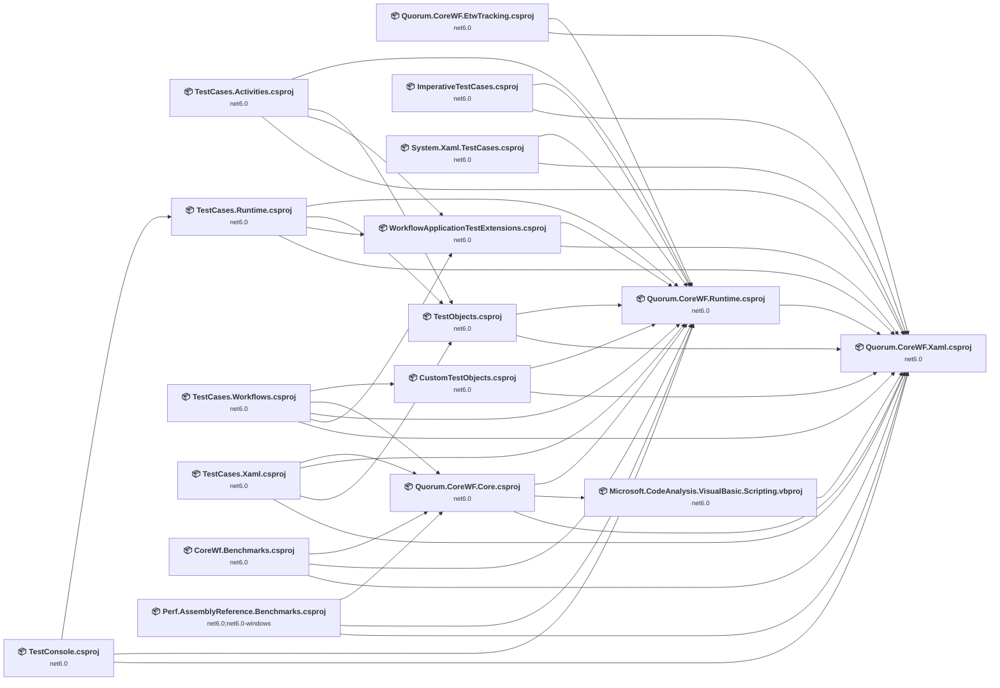

## Project Details

### Perf\CoreWf.Benchmarks\CoreWf.Benchmarks.csproj

#### Project Info

- **Current Target Framework:** net6.0
- **Proposed Target Framework:** net10.0
- **SDK-style**: True
- **Project Kind:** DotNetCoreApp
- **Dependencies**: 3
- **Dependants**: 0
- **Number of Files**: 5
- **Number of Files with Incidents**: 2
- **Lines of Code**: 319
- **Estimated LOC to modify**: 0+ (at least 0.0% of the project)

#### Dependency Graph

Legend:
📦 SDK-style project
⚙️ Classic project

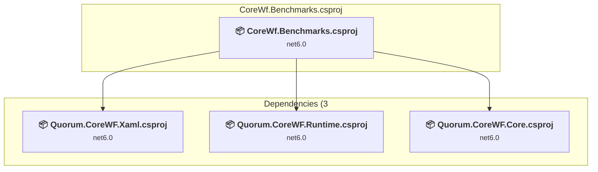

### API Compatibility

| Category | Count | Impact |
| :--- | :---: | :--- |
| 🔴 Binary Incompatible | 0 | High - Require code changes |
| 🟡 Source Incompatible | 0 | Medium - Needs re-compilation and potential conflicting API error fixing |
| 🔵 Behavioral change | 0 | Low - Behavioral changes that may require testing at runtime |
| ✅ Compatible | 260 |  |
| ***Total APIs Analyzed*** | ***260*** |  |

### Perf\Perf.AssemblyReference.Benchmarks\Perf.AssemblyReference.Benchmarks.csproj

#### Project Info

- **Current Target Framework:** net6.0;net6.0-windows
- **Proposed Target Framework:** net6.0;net6.0-windows;net10.0;net10.0--windows
- **SDK-style**: True
- **Project Kind:** DotNetCoreApp
- **Dependencies**: 3
- **Dependants**: 0
- **Number of Files**: 2
- **Number of Files with Incidents**: 3
- **Lines of Code**: 195
- **Estimated LOC to modify**: 8+ (at least 4.1% of the project)

#### Dependency Graph

Legend:
📦 SDK-style project
⚙️ Classic project

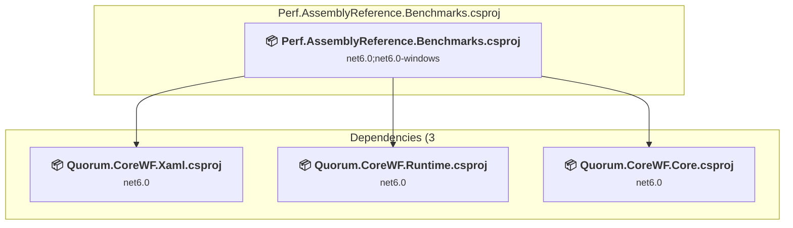

### API Compatibility

| Category | Count | Impact |
| :--- | :---: | :--- |
| 🔴 Binary Incompatible | 0 | High - Require code changes |
| 🟡 Source Incompatible | 6 | Medium - Needs re-compilation and potential conflicting API error fixing |
| 🔵 Behavioral change | 2 | Low - Behavioral changes that may require testing at runtime |
| ✅ Compatible | 181 |  |
| ***Total APIs Analyzed*** | ***189*** |  |

### Quorum.CoreWF.Core\Quorum.CoreWF.Core.csproj

#### Project Info

- **Current Target Framework:** net6.0
- **Proposed Target Framework:** net10.0
- **SDK-style**: True
- **Project Kind:** ClassLibrary
- **Dependencies**: 3
- **Dependants**: 4
- **Number of Files**: 90
- **Number of Files with Incidents**: 7
- **Lines of Code**: 16227
- **Estimated LOC to modify**: 2120+ (at least 13.1% of the project)

#### Dependency Graph

Legend:
📦 SDK-style project
⚙️ Classic project

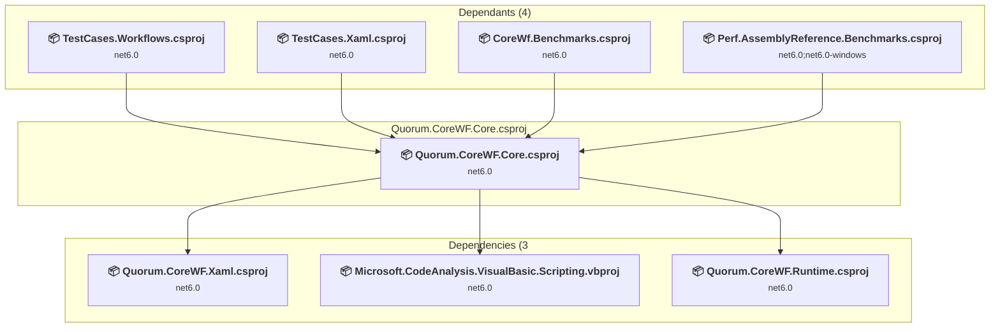

### API Compatibility

| Category | Count | Impact |
| :--- | :---: | :--- |
| 🔴 Binary Incompatible | 0 | High - Require code changes |
| 🟡 Source Incompatible | 2116 | Medium - Needs re-compilation and potential conflicting API error fixing |
| 🔵 Behavioral change | 4 | Low - Behavioral changes that may require testing at runtime |
| ✅ Compatible | 9398 |  |
| ***Total APIs Analyzed*** | ***11518*** |  |

#### Project Technologies and Features

| Technology | Issues | Percentage | Migration Path |
| :--- | :---: | :---: | :--- |
| CodeDom & Dynamic Code Generation | 2113 | 99.7% | Runtime code generation, compilation, and scripting APIs including CodeDom and JScript that have limited support in .NET Core/.NET. These were used for dynamic code generation but are largely obsolete. Consider Roslyn APIs for code generation or alternative scripting solutions. |

### Quorum.CoreWF.EtwTracking\Quorum.CoreWF.EtwTracking.csproj

#### Project Info

- **Current Target Framework:** net6.0
- **Proposed Target Framework:** net10.0
- **SDK-style**: True
- **Project Kind:** ClassLibrary
- **Dependencies**: 2
- **Dependants**: 0
- **Number of Files**: 5
- **Number of Files with Incidents**: 2
- **Lines of Code**: 913
- **Estimated LOC to modify**: 0+ (at least 0.0% of the project)

#### Dependency Graph

Legend:
📦 SDK-style project
⚙️ Classic project

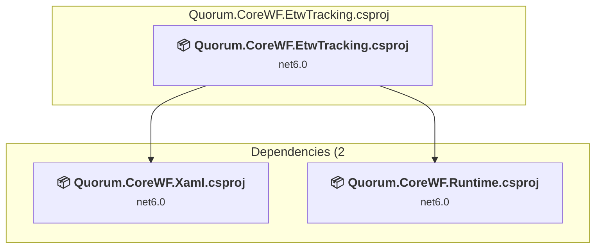

### API Compatibility

| Category | Count | Impact |
| :--- | :---: | :--- |
| 🔴 Binary Incompatible | 0 | High - Require code changes |
| 🟡 Source Incompatible | 0 | Medium - Needs re-compilation and potential conflicting API error fixing |
| 🔵 Behavioral change | 0 | Low - Behavioral changes that may require testing at runtime |
| ✅ Compatible | 1347 |  |
| ***Total APIs Analyzed*** | ***1347*** |  |

### Quorum.CoreWF.Runtime\Quorum.CoreWF.Runtime.csproj

#### Project Info

- **Current Target Framework:** net6.0
- **Proposed Target Framework:** net10.0
- **SDK-style**: True
- **Project Kind:** ClassLibrary
- **Dependencies**: 1
- **Dependants**: 14
- **Number of Files**: 487
- **Number of Files with Incidents**: 13
- **Lines of Code**: 78381
- **Estimated LOC to modify**: 23+ (at least 0.0% of the project)

#### Dependency Graph

Legend:
📦 SDK-style project
⚙️ Classic project

```mermaid
flowchart TB
    subgraph upstream["Dependants (14)"]
        P2["<b>📦&nbsp;Quorum.CoreWF.EtwTracking.csproj</b><br/><small>net6.0</small>"]
        P3["<b>📦&nbsp;TestObjects.csproj</b><br/><small>net6.0</small>"]
        P4["<b>📦&nbsp;TestCases.Activities.csproj</b><br/><small>net6.0</small>"]
        P5["<b>📦&nbsp;TestCases.Runtime.csproj</b><br/><small>net6.0</small>"]
        P6["<b>📦&nbsp;TestCases.Workflows.csproj</b><br/><small>net6.0</small>"]
        P7["<b>📦&nbsp;ImperativeTestCases.csproj</b><br/><small>net6.0</small>"]
        P9["<b>📦&nbsp;System.Xaml.TestCases.csproj</b><br/><small>net6.0</small>"]
        P10["<b>📦&nbsp;TestCases.Xaml.csproj</b><br/><small>net6.0</small>"]
        P11["<b>📦&nbsp;Quorum.CoreWF.Core.csproj</b><br/><small>net6.0</small>"]
        P13["<b>📦&nbsp;TestConsole.csproj</b><br/><small>net6.0</small>"]
        P14["<b>📦&nbsp;CoreWf.Benchmarks.csproj</b><br/><small>net6.0</small>"]
        P15["<b>📦&nbsp;CustomTestObjects.csproj</b><br/><small>net6.0</small>"]
        P16["<b>📦&nbsp;WorkflowApplicationTestExtensions.csproj</b><br/><small>net6.0</small>"]
        P17["<b>📦&nbsp;Perf.AssemblyReference.Benchmarks.csproj</b><br/><small>net6.0;net6.0-windows</small>"]
        click P2 "#quorumcorewfetwtrackingquorumcorewfetwtrackingcsproj"
        click P3 "#testtestobjectstestobjectscsproj"
        click P4 "#testtestcasesactivitiestestcasesactivitiescsproj"
        click P5 "#testtestcasesruntimetestcasesruntimecsproj"
        click P6 "#testtestcasesworkflowstestcasesworkflowscsproj"
        click P7 "#testimperativetestcasesimperativetestcasescsproj"
        click P9 "#testsystemxamltestcasessystemxamltestcasescsproj"
        click P10 "#testtestcasesxamltestcasesxamlcsproj"
        click P11 "#quorumcorewfcorequorumcorewfcorecsproj"
        click P13 "#testtestconsoletestconsolecsproj"
        click P14 "#perfcorewfbenchmarkscorewfbenchmarkscsproj"
        click P15 "#testcustomtestobjectscustomtestobjectscsproj"
        click P16 "#testworkflowapplicationtestextensionsworkflowapplicationtestextensionscsproj"
        click P17 "#perfperfassemblyreferencebenchmarksperfassemblyreferencebenchmarkscsproj"
    end
    subgraph current["Quorum.CoreWF.Runtime.csproj"]
        MAIN["<b>📦&nbsp;Quorum.CoreWF.Runtime.csproj</b><br/><small>net6.0</small>"]
        click MAIN "#quorumcorewfruntimequorumcorewfruntimecsproj"
    end
    subgraph downstream["Dependencies (1"]
        P8["<b>📦&nbsp;Quorum.CoreWF.Xaml.csproj</b><br/><small>net6.0</small>"]
        click P8 "#quorumcorewfxamlquorumcorewfxamlcsproj"
    end
    P2 --> MAIN
    P3 --> MAIN
    P4 --> MAIN
    P5 --> MAIN
    P6 --> MAIN
    P7 --> MAIN
    P9 --> MAIN
    P10 --> MAIN
    P11 --> MAIN
    P13 --> MAIN
    P14 --> MAIN
    P15 --> MAIN
    P16 --> MAIN
    P17 --> MAIN
    MAIN --> P8

```

### API Compatibility

| Category | Count | Impact |
| :--- | :---: | :--- |
| 🔴 Binary Incompatible | 0 | High - Require code changes |
| 🟡 Source Incompatible | 23 | Medium - Needs re-compilation and potential conflicting API error fixing |
| 🔵 Behavioral change | 0 | Low - Behavioral changes that may require testing at runtime |
| ✅ Compatible | 43024 |  |
| ***Total APIs Analyzed*** | ***43047*** |  |

### Quorum.CoreWF.Xaml\Quorum.CoreWF.Xaml.csproj

#### Project Info

- **Current Target Framework:** net6.0
- **Proposed Target Framework:** net10.0
- **SDK-style**: True
- **Project Kind:** ClassLibrary
- **Dependencies**: 0
- **Dependants**: 16
- **Number of Files**: 189
- **Number of Files with Incidents**: 22
- **Lines of Code**: 49105
- **Estimated LOC to modify**: 95+ (at least 0.2% of the project)

#### Dependency Graph

Legend:
📦 SDK-style project
⚙️ Classic project

```mermaid
flowchart TB
    subgraph upstream["Dependants (16)"]
        P1["<b>📦&nbsp;Quorum.CoreWF.Runtime.csproj</b><br/><small>net6.0</small>"]
        P2["<b>📦&nbsp;Quorum.CoreWF.EtwTracking.csproj</b><br/><small>net6.0</small>"]
        P3["<b>📦&nbsp;TestObjects.csproj</b><br/><small>net6.0</small>"]
        P4["<b>📦&nbsp;TestCases.Activities.csproj</b><br/><small>net6.0</small>"]
        P5["<b>📦&nbsp;TestCases.Runtime.csproj</b><br/><small>net6.0</small>"]
        P6["<b>📦&nbsp;TestCases.Workflows.csproj</b><br/><small>net6.0</small>"]
        P7["<b>📦&nbsp;ImperativeTestCases.csproj</b><br/><small>net6.0</small>"]
        P9["<b>📦&nbsp;System.Xaml.TestCases.csproj</b><br/><small>net6.0</small>"]
        P10["<b>📦&nbsp;TestCases.Xaml.csproj</b><br/><small>net6.0</small>"]
        P11["<b>📦&nbsp;Quorum.CoreWF.Core.csproj</b><br/><small>net6.0</small>"]
        P12["<b>📦&nbsp;Microsoft.CodeAnalysis.VisualBasic.Scripting.vbproj</b><br/><small>net6.0</small>"]
        P13["<b>📦&nbsp;TestConsole.csproj</b><br/><small>net6.0</small>"]
        P14["<b>📦&nbsp;CoreWf.Benchmarks.csproj</b><br/><small>net6.0</small>"]
        P15["<b>📦&nbsp;CustomTestObjects.csproj</b><br/><small>net6.0</small>"]
        P16["<b>📦&nbsp;WorkflowApplicationTestExtensions.csproj</b><br/><small>net6.0</small>"]
        P17["<b>📦&nbsp;Perf.AssemblyReference.Benchmarks.csproj</b><br/><small>net6.0;net6.0-windows</small>"]
        click P1 "#quorumcorewfruntimequorumcorewfruntimecsproj"
        click P2 "#quorumcorewfetwtrackingquorumcorewfetwtrackingcsproj"
        click P3 "#testtestobjectstestobjectscsproj"
        click P4 "#testtestcasesactivitiestestcasesactivitiescsproj"
        click P5 "#testtestcasesruntimetestcasesruntimecsproj"
        click P6 "#testtestcasesworkflowstestcasesworkflowscsproj"
        click P7 "#testimperativetestcasesimperativetestcasescsproj"
        click P9 "#testsystemxamltestcasessystemxamltestcasescsproj"
        click P10 "#testtestcasesxamltestcasesxamlcsproj"
        click P11 "#quorumcorewfcorequorumcorewfcorecsproj"
        click P12 "#visualbasicmicrosoftcodeanalysisvisualbasicscriptingvbproj"
        click P13 "#testtestconsoletestconsolecsproj"
        click P14 "#perfcorewfbenchmarkscorewfbenchmarkscsproj"
        click P15 "#testcustomtestobjectscustomtestobjectscsproj"
        click P16 "#testworkflowapplicationtestextensionsworkflowapplicationtestextensionscsproj"
        click P17 "#perfperfassemblyreferencebenchmarksperfassemblyreferencebenchmarkscsproj"
    end
    subgraph current["Quorum.CoreWF.Xaml.csproj"]
        MAIN["<b>📦&nbsp;Quorum.CoreWF.Xaml.csproj</b><br/><small>net6.0</small>"]
        click MAIN "#quorumcorewfxamlquorumcorewfxamlcsproj"
    end
    P1 --> MAIN
    P2 --> MAIN
    P3 --> MAIN
    P4 --> MAIN
    P5 --> MAIN
    P6 --> MAIN
    P7 --> MAIN
    P9 --> MAIN
    P10 --> MAIN
    P11 --> MAIN
    P12 --> MAIN
    P13 --> MAIN
    P14 --> MAIN
    P15 --> MAIN
    P16 --> MAIN
    P17 --> MAIN

```

### API Compatibility

| Category | Count | Impact |
| :--- | :---: | :--- |
| 🔴 Binary Incompatible | 0 | High - Require code changes |
| 🟡 Source Incompatible | 6 | Medium - Needs re-compilation and potential conflicting API error fixing |
| 🔵 Behavioral change | 89 | Low - Behavioral changes that may require testing at runtime |
| ✅ Compatible | 22843 |  |
| ***Total APIs Analyzed*** | ***22938*** |  |

### Test\CustomTestObjects\CustomTestObjects.csproj

#### Project Info

- **Current Target Framework:** net6.0
- **Proposed Target Framework:** net10.0
- **SDK-style**: True
- **Project Kind:** DotNetCoreApp
- **Dependencies**: 2
- **Dependants**: 1
- **Number of Files**: 4
- **Number of Files with Incidents**: 2
- **Lines of Code**: 6
- **Estimated LOC to modify**: 0+ (at least 0.0% of the project)

#### Dependency Graph

Legend:
📦 SDK-style project
⚙️ Classic project

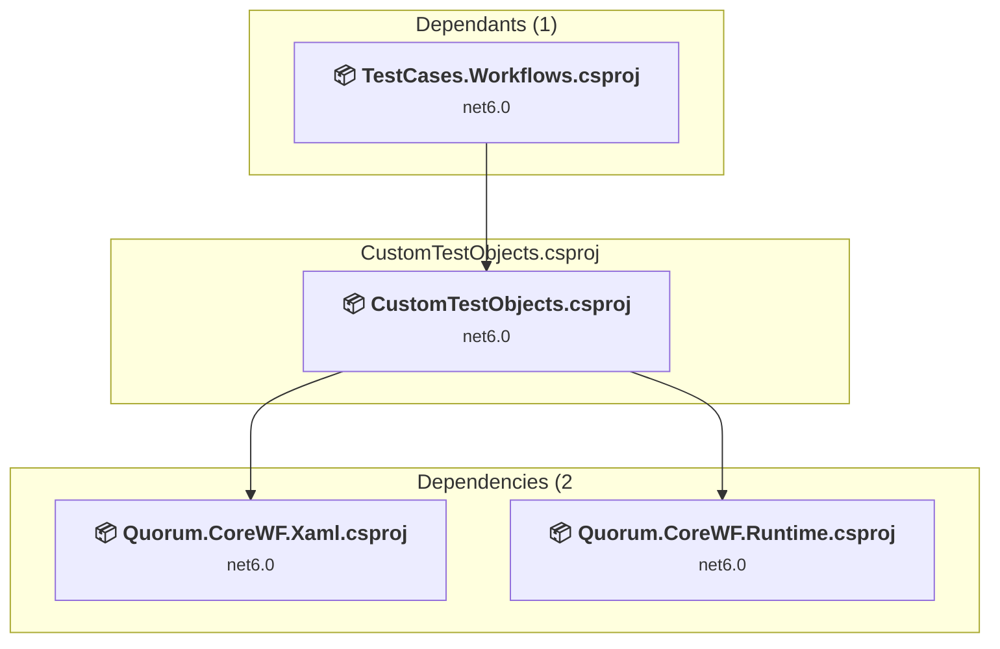

### API Compatibility

| Category | Count | Impact |
| :--- | :---: | :--- |
| 🔴 Binary Incompatible | 0 | High - Require code changes |
| 🟡 Source Incompatible | 0 | Medium - Needs re-compilation and potential conflicting API error fixing |
| 🔵 Behavioral change | 0 | Low - Behavioral changes that may require testing at runtime |
| ✅ Compatible | 5 |  |
| ***Total APIs Analyzed*** | ***5*** |  |

### Test\ImperativeTestCases\ImperativeTestCases.csproj

#### Project Info

- **Current Target Framework:** net6.0
- **Proposed Target Framework:** net10.0
- **SDK-style**: True
- **Project Kind:** DotNetCoreApp
- **Dependencies**: 2
- **Dependants**: 0
- **Number of Files**: 6
- **Number of Files with Incidents**: 2
- **Lines of Code**: 248
- **Estimated LOC to modify**: 0+ (at least 0.0% of the project)

#### Dependency Graph

Legend:
📦 SDK-style project
⚙️ Classic project

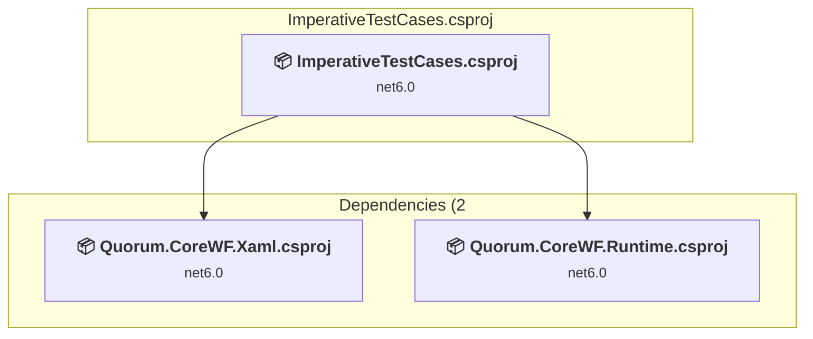

### API Compatibility

| Category | Count | Impact |
| :--- | :---: | :--- |
| 🔴 Binary Incompatible | 0 | High - Require code changes |
| 🟡 Source Incompatible | 0 | Medium - Needs re-compilation and potential conflicting API error fixing |
| 🔵 Behavioral change | 0 | Low - Behavioral changes that may require testing at runtime |
| ✅ Compatible | 164 |  |
| ***Total APIs Analyzed*** | ***164*** |  |

### Test\System.Xaml.TestCases\System.Xaml.TestCases.csproj

#### Project Info

- **Current Target Framework:** net6.0
- **Proposed Target Framework:** net10.0
- **SDK-style**: True
- **Project Kind:** DotNetCoreApp
- **Dependencies**: 2
- **Dependants**: 0
- **Number of Files**: 53
- **Number of Files with Incidents**: 7
- **Lines of Code**: 20562
- **Estimated LOC to modify**: 17+ (at least 0.1% of the project)

#### Dependency Graph

Legend:
📦 SDK-style project
⚙️ Classic project

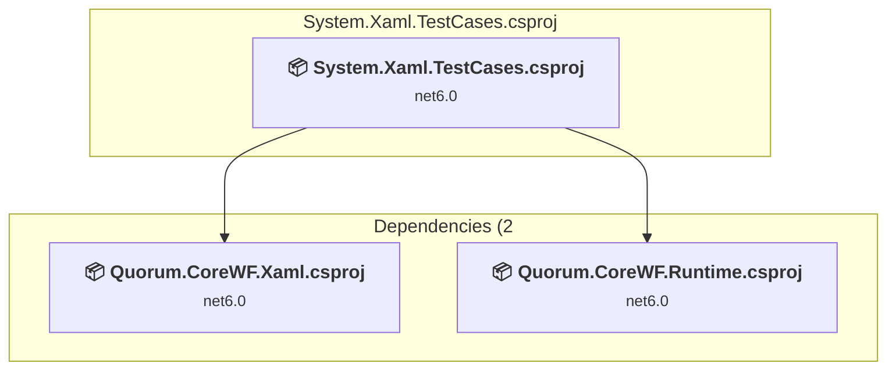

### API Compatibility

| Category | Count | Impact |
| :--- | :---: | :--- |
| 🔴 Binary Incompatible | 0 | High - Require code changes |
| 🟡 Source Incompatible | 3 | Medium - Needs re-compilation and potential conflicting API error fixing |
| 🔵 Behavioral change | 14 | Low - Behavioral changes that may require testing at runtime |
| ✅ Compatible | 25691 |  |
| ***Total APIs Analyzed*** | ***25708*** |  |

### Test\TestCases.Activities\TestCases.Activities.csproj

#### Project Info

- **Current Target Framework:** net6.0
- **Proposed Target Framework:** net10.0
- **SDK-style**: True
- **Project Kind:** DotNetCoreApp
- **Dependencies**: 4
- **Dependants**: 0
- **Number of Files**: 80
- **Number of Files with Incidents**: 3
- **Lines of Code**: 28168
- **Estimated LOC to modify**: 2+ (at least 0.0% of the project)

#### Dependency Graph

Legend:
📦 SDK-style project
⚙️ Classic project

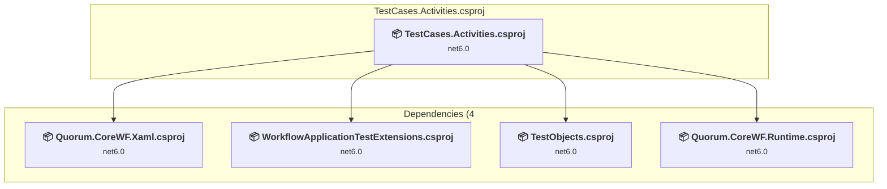

### API Compatibility

| Category | Count | Impact |
| :--- | :---: | :--- |
| 🔴 Binary Incompatible | 0 | High - Require code changes |
| 🟡 Source Incompatible | 0 | Medium - Needs re-compilation and potential conflicting API error fixing |
| 🔵 Behavioral change | 2 | Low - Behavioral changes that may require testing at runtime |
| ✅ Compatible | 13548 |  |
| ***Total APIs Analyzed*** | ***13550*** |  |

### Test\TestCases.Runtime\TestCases.Runtime.csproj

#### Project Info

- **Current Target Framework:** net6.0
- **Proposed Target Framework:** net10.0
- **SDK-style**: True
- **Project Kind:** DotNetCoreApp
- **Dependencies**: 4
- **Dependants**: 1
- **Number of Files**: 17
- **Number of Files with Incidents**: 6
- **Lines of Code**: 2504
- **Estimated LOC to modify**: 13+ (at least 0.5% of the project)

#### Dependency Graph

Legend:
📦 SDK-style project
⚙️ Classic project

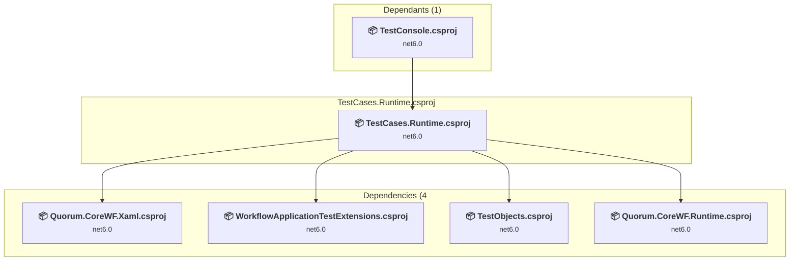

### API Compatibility

| Category | Count | Impact |
| :--- | :---: | :--- |
| 🔴 Binary Incompatible | 0 | High - Require code changes |
| 🟡 Source Incompatible | 13 | Medium - Needs re-compilation and potential conflicting API error fixing |
| 🔵 Behavioral change | 0 | Low - Behavioral changes that may require testing at runtime |
| ✅ Compatible | 1908 |  |
| ***Total APIs Analyzed*** | ***1921*** |  |

### Test\TestCases.Workflows\TestCases.Workflows.csproj

#### Project Info

- **Current Target Framework:** net6.0
- **Proposed Target Framework:** net10.0
- **SDK-style**: True
- **Project Kind:** DotNetCoreApp
- **Dependencies**: 5
- **Dependants**: 0
- **Number of Files**: 41
- **Number of Files with Incidents**: 3
- **Lines of Code**: 4672
- **Estimated LOC to modify**: 53+ (at least 1.1% of the project)

#### Dependency Graph

Legend:
📦 SDK-style project
⚙️ Classic project

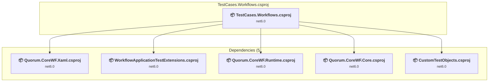

### API Compatibility

| Category | Count | Impact |
| :--- | :---: | :--- |
| 🔴 Binary Incompatible | 0 | High - Require code changes |
| 🟡 Source Incompatible | 53 | Medium - Needs re-compilation and potential conflicting API error fixing |
| 🔵 Behavioral change | 0 | Low - Behavioral changes that may require testing at runtime |
| ✅ Compatible | 3856 |  |
| ***Total APIs Analyzed*** | ***3909*** |  |

#### Project Technologies and Features

| Technology | Issues | Percentage | Migration Path |
| :--- | :---: | :---: | :--- |
| CodeDom & Dynamic Code Generation | 51 | 96.2% | Runtime code generation, compilation, and scripting APIs including CodeDom and JScript that have limited support in .NET Core/.NET. These were used for dynamic code generation but are largely obsolete. Consider Roslyn APIs for code generation or alternative scripting solutions. |

### Test\TestCases.Xaml\TestCases.Xaml.csproj

#### Project Info

- **Current Target Framework:** net6.0
- **Proposed Target Framework:** net10.0
- **SDK-style**: True
- **Project Kind:** DotNetCoreApp
- **Dependencies**: 4
- **Dependants**: 0
- **Number of Files**: 10
- **Number of Files with Incidents**: 3
- **Lines of Code**: 1521
- **Estimated LOC to modify**: 6+ (at least 0.4% of the project)

#### Dependency Graph

Legend:
📦 SDK-style project
⚙️ Classic project

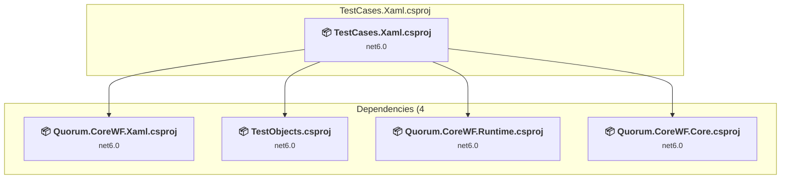

### API Compatibility

| Category | Count | Impact |
| :--- | :---: | :--- |
| 🔴 Binary Incompatible | 0 | High - Require code changes |
| 🟡 Source Incompatible | 1 | Medium - Needs re-compilation and potential conflicting API error fixing |
| 🔵 Behavioral change | 5 | Low - Behavioral changes that may require testing at runtime |
| ✅ Compatible | 1119 |  |
| ***Total APIs Analyzed*** | ***1125*** |  |

### Test\TestConsole\TestConsole.csproj

#### Project Info

- **Current Target Framework:** net6.0
- **Proposed Target Framework:** net10.0
- **SDK-style**: True
- **Project Kind:** DotNetCoreApp
- **Dependencies**: 3
- **Dependants**: 0
- **Number of Files**: 4
- **Number of Files with Incidents**: 2
- **Lines of Code**: 36
- **Estimated LOC to modify**: 0+ (at least 0.0% of the project)

#### Dependency Graph

Legend:
📦 SDK-style project
⚙️ Classic project

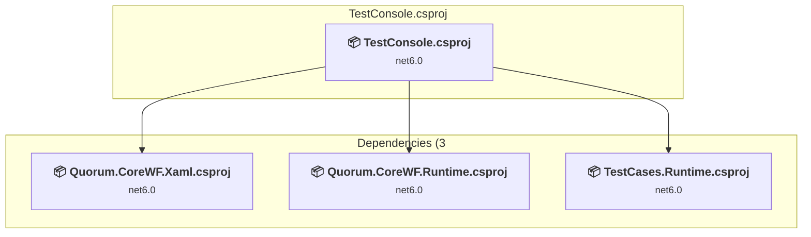

### API Compatibility

| Category | Count | Impact |
| :--- | :---: | :--- |
| 🔴 Binary Incompatible | 0 | High - Require code changes |
| 🟡 Source Incompatible | 0 | Medium - Needs re-compilation and potential conflicting API error fixing |
| 🔵 Behavioral change | 0 | Low - Behavioral changes that may require testing at runtime |
| ✅ Compatible | 11 |  |
| ***Total APIs Analyzed*** | ***11*** |  |

### Test\TestObjects\TestObjects.csproj

#### Project Info

- **Current Target Framework:** net6.0
- **Proposed Target Framework:** net10.0
- **SDK-style**: True
- **Project Kind:** DotNetCoreApp
- **Dependencies**: 2
- **Dependants**: 3
- **Number of Files**: 229
- **Number of Files with Incidents**: 9
- **Lines of Code**: 32656
- **Estimated LOC to modify**: 91+ (at least 0.3% of the project)

#### Dependency Graph

Legend:
📦 SDK-style project
⚙️ Classic project

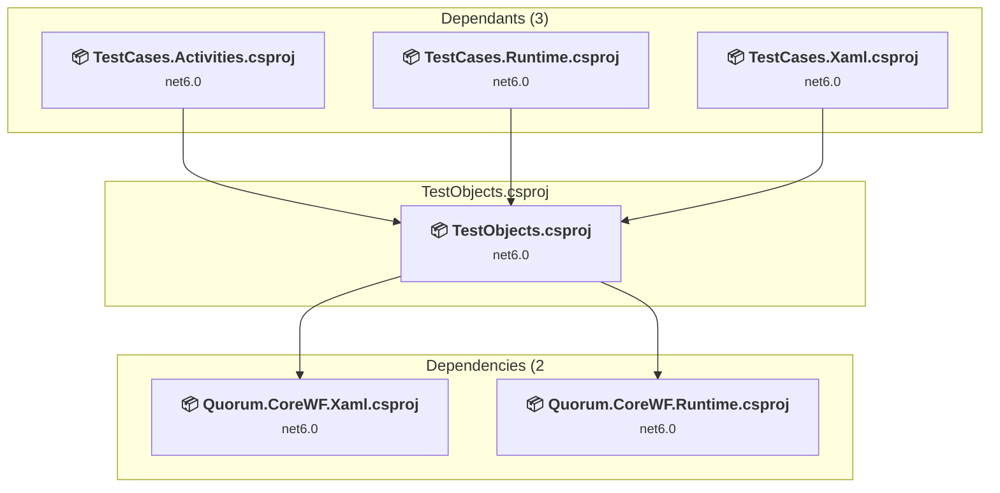

### API Compatibility

| Category | Count | Impact |
| :--- | :---: | :--- |
| 🔴 Binary Incompatible | 0 | High - Require code changes |
| 🟡 Source Incompatible | 91 | Medium - Needs re-compilation and potential conflicting API error fixing |
| 🔵 Behavioral change | 0 | Low - Behavioral changes that may require testing at runtime |
| ✅ Compatible | 16085 |  |
| ***Total APIs Analyzed*** | ***16176*** |  |

### Test\WorkflowApplicationTestExtensions\WorkflowApplicationTestExtensions.csproj

#### Project Info

- **Current Target Framework:** net6.0
- **Proposed Target Framework:** net10.0
- **SDK-style**: True
- **Project Kind:** DotNetCoreApp
- **Dependencies**: 2
- **Dependants**: 3
- **Number of Files**: 12
- **Number of Files with Incidents**: 3
- **Lines of Code**: 624
- **Estimated LOC to modify**: 1+ (at least 0.2% of the project)

#### Dependency Graph

Legend:
📦 SDK-style project
⚙️ Classic project

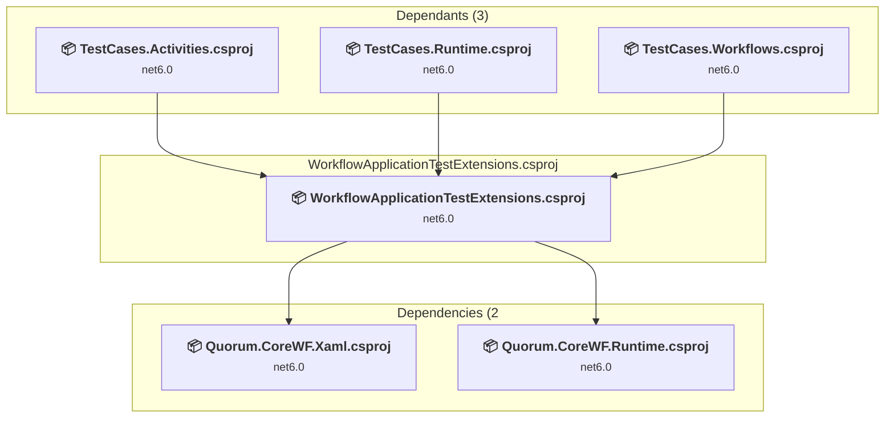

### API Compatibility

| Category | Count | Impact |
| :--- | :---: | :--- |
| 🔴 Binary Incompatible | 0 | High - Require code changes |
| 🟡 Source Incompatible | 1 | Medium - Needs re-compilation and potential conflicting API error fixing |
| 🔵 Behavioral change | 0 | Low - Behavioral changes that may require testing at runtime |
| ✅ Compatible | 480 |  |
| ***Total APIs Analyzed*** | ***481*** |  |

### VisualBasic\Microsoft.CodeAnalysis.VisualBasic.Scripting.vbproj

#### Project Info

- **Current Target Framework:** net6.0
- **Proposed Target Framework:** net10.0
- **SDK-style**: True
- **Project Kind:** ClassLibrary
- **Dependencies**: 1
- **Dependants**: 1
- **Number of Files**: 11
- **Number of Files with Incidents**: 2
- **Lines of Code**: 679
- **Estimated LOC to modify**: 0+ (at least 0.0% of the project)

#### Dependency Graph

Legend:
📦 SDK-style project
⚙️ Classic project

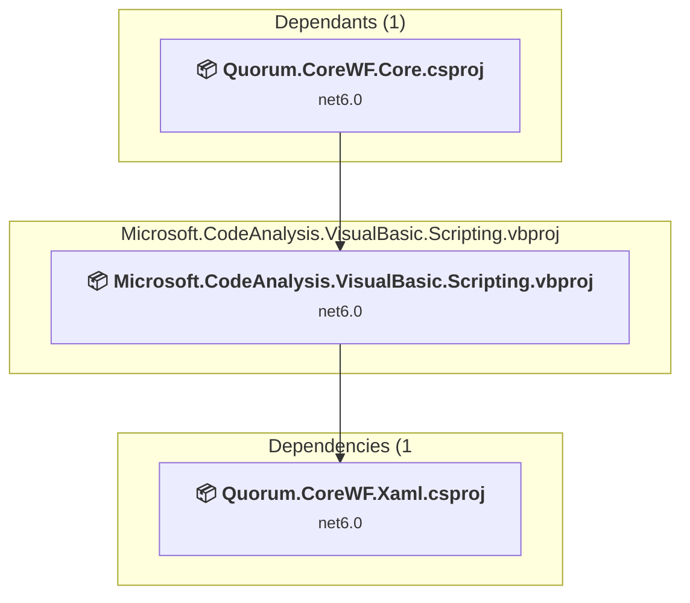

### API Compatibility

| Category | Count | Impact |
| :--- | :---: | :--- |
| 🔴 Binary Incompatible | 0 | High - Require code changes |
| 🟡 Source Incompatible | 0 | Medium - Needs re-compilation and potential conflicting API error fixing |
| 🔵 Behavioral change | 0 | Low - Behavioral changes that may require testing at runtime |
| ✅ Compatible | 613 |  |
| ***Total APIs Analyzed*** | ***613*** |  |

